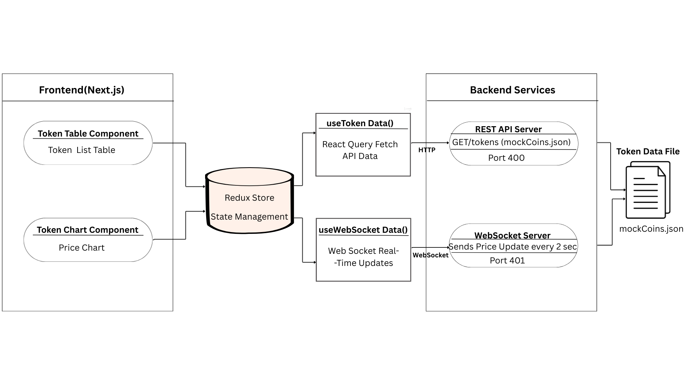
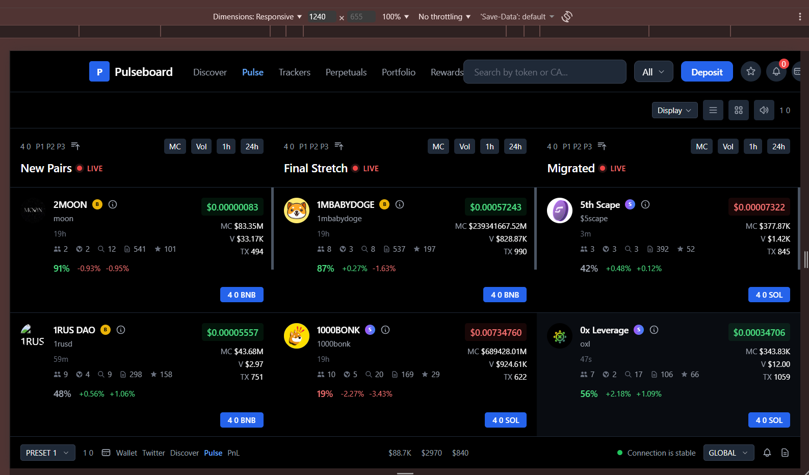
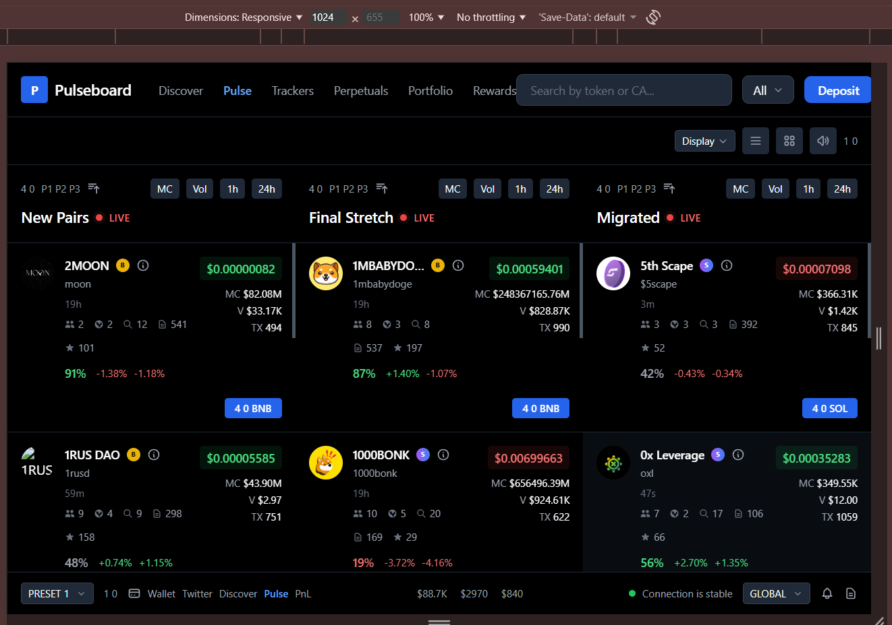
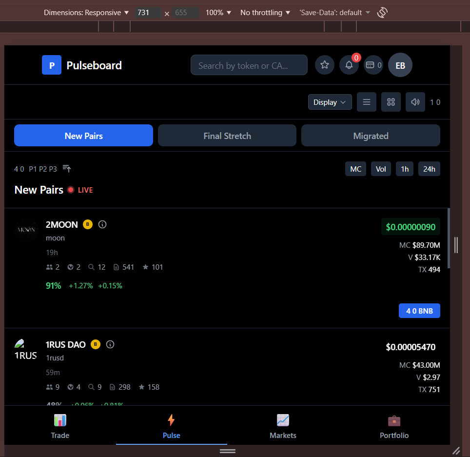
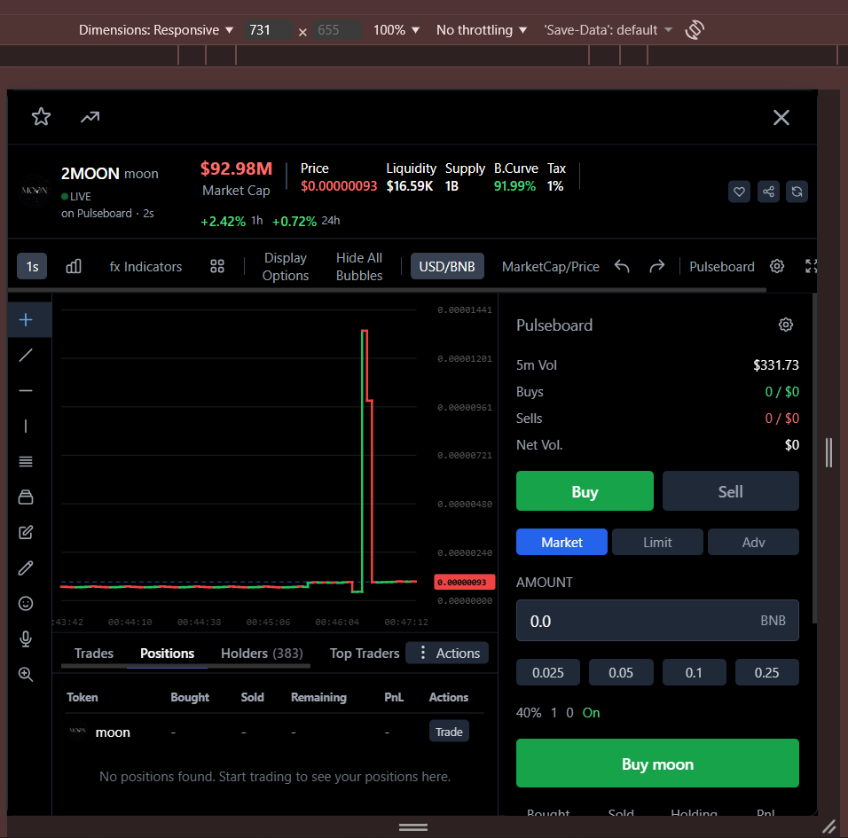
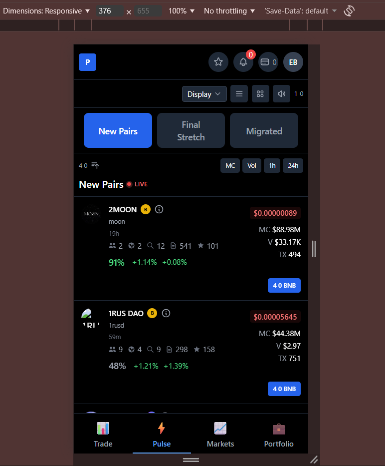
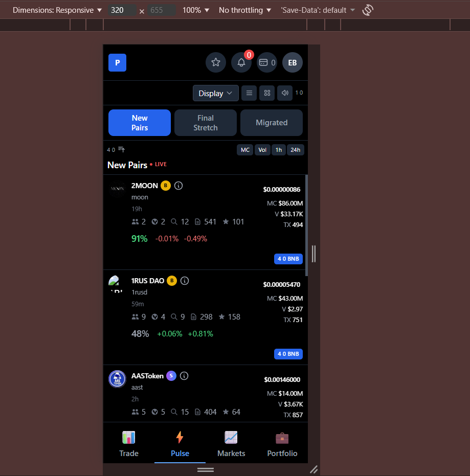

# Token Trading Table

## Tech Stack

- **Frontend**: Next.js 14 (App Router), React 18, TypeScript
- **State Management**: Redux Toolkit
- **Data Fetching**: React Query 
- **Styling**: Tailwind CSS
- **UI Components**: Radix UI / shadcn/ui
- **Backend**: Express.js (REST API), WebSocket Server

## Features

- **Real-time Price Updates**: price updates via WebSocket every 2 seconds (mock data is used services/data/
    mockCoins.json)
- **Interactive Charts**: Dynamic price charts with smooth transitions
- **Token Categories**: Organized into New Pairs, Final Stretch, and Migrated tokens
- **Responsive Design**: Fully responsive from 320px to 4K displays
- **Sorting & Filtering**: Sort by market cap, volume, 1h/24h changes
- **Token Details Modal**: Comprehensive token information with trading options

## Project Structure

```
token-trading-table/
├── apps/
│   └── web/                 # Next.js frontend application
├── services/
    ├── api/                 # REST API server
    └── websocket/           # WebSocket server
```

## Prerequisites

- Node.js 18+ and npm

## Installation

### 1. Clone the repository

```bash
git clone <repository-url>
cd token-trading-table
```

### 2. Install Frontend Dependencies

```bash
cd apps/web
npm install
```

### 3. Install API Server Dependencies

```bash
cd ../../services/api
npm install
```

### 4. Install WebSocket Server Dependencies

```bash
cd ../websocket
npm install
```

## Configuration

### Frontend Environment Variables

Create a `.env.local` file in `apps/web/`:

```env
NEXT_PUBLIC_API_URL=API_URL
NEXT_PUBLIC_WS_URL=ws:websocket_url
```


## System Architecture



The application follows a three-tier architecture:

1. **Frontend (Next.js)**: React components with Redux for state management
2. **REST API Server**: Provides initial token data
3. **WebSocket Server**: Broadcasts real-time price updates

### Data Flow

- **Initial Load**: Frontend fetches token data from REST API → Normalizes → Stores in Redux → Renders
- **Real-time Updates**: WebSocket server broadcasts price updates → Frontend receives → Updates Redux → Components re-render
- **Chart Updates**: Chart components subscribe to Redux state → Append new price points → Render updated chart

## Key Features Explained

### Real-time Price Updates

Prices update every 2 seconds via WebSocket connection. The UI shows color transitions (green for up, red for down) and price direction indicators.

### Token Categories

- **New Pairs**: Recently added tokens
- **Final Stretch**: Tokens in final phase
- **Migrated**: Tokens that have migrated

### Sorting Options

Click on column headers (MC, Vol, 1h, 24h) to sort tokens by:
- Market Cap
- 24h Volume
- 1-hour change percentage
- 24-hour change percentage

### Token Details

Click on any token row to open a detailed modal showing:
- Real-time price chart
- Market statistics
- Trading options
- Additional token information

## Development

### Code Structure

- **Components**: Reusable UI components in `apps/web/src/components/`
- **Hooks**: Custom React hooks in `apps/web/src/hooks/`
- **Store**: Redux store configuration in `apps/web/src/store/`
- **Domain**: Business logic and data normalization in `apps/web/src/domain/`
- **Services**: External service integrations in `apps/web/src/services/`

### Key Technologies

- **TypeScript**: Strict typing throughout
- **Redux Toolkit**: Centralized state management
- **React Query**: Server state and caching
- **Tailwind CSS**: Utility-first styling

## Responsive Design

The application is fully responsive and tested across multiple breakpoints:

### Desktop (1240px)


### Tablet (1024px)


### Mobile Large (730px - 731px)



### Mobile Medium (375px)


### Mobile Small (320px)



